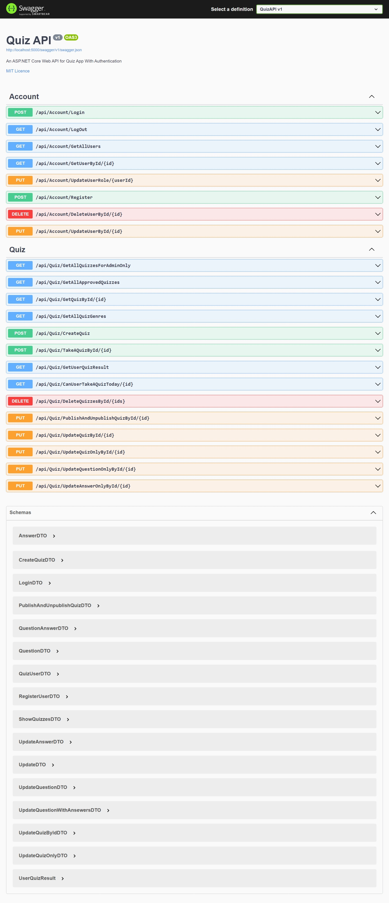

# QuizApi Project
This is a simple app for quiz taking with authentication

## Project overview



## About The Project
1.	User can register by providing the their basic information along with email and password
1.	Users can login using email and password to
    1. take a quiz
    1. show history of quizzes they took
    1. and Create their own quiz which needs to be reviewed by the administrator before it's published
1. Quiz Portal Management includes the following
    1. create read update delete Quiz
    1. Publish & unpublishing quizzes
    1. Multiple-Answer based questions for each quiz.
    1. Minimum 1 question per quiz before publishing
    1. Minimum 2 answers per question before question creation
    1. In each question there is only on answer which has to be ticked as correct answer
    1. Validity of duration of quiz. For example: a quiz shall be submitted within 10 mins.
    1. different genres of quizzes will be created based on previus quizzes
1. multiple requirements is impleamented to take a quiz
    1. 	Users can attempt to take a particular quiz twice per day.
    1. Once a user finishes taking a quiz, then the duration limit of the quiz will be compared with the actual time of the user’s submission. The scenarios are following:
        1. If a user fails the duration limit, then the success rate is zero. otherwise, each answer are calculated before  recording them as an attempt record

1. the quiz history records the following
    1.	Time the quiz was taken 
    1. 	Time the quiz was 
    1. 	The success rate in percentage. Ex: out of 4 questions two answers were correct, therefore the success rate is 50% or 0.5
1. User is allowed to attempt on a particular quiz only twice a day
1. when it comes to the roles and permissions the pojects works the following
    1. the roles must be pre-determined due to the way how ASP Identity membership works
    1. the projects uses roles of `admin` and `user` to differentiate authorization
    1. only Admins can change others Roles
    1. admins have full privilege
    1. other users have limited permission 
1. all endpoints are RESTfull
1. all endpoints are properly authorized
1. all inputs are properly authorized
1. the code is very readable following naming conventions with understandable comments 
1. all errors are handled properly
1. a caching system is impleamented 


## How to get started 
---
**Note** : dotnet 6 sdk and postgres is required

for the project run this command in the root of directory

`dotnet run`

**Note**  the app will create and seed the database with admin account with Role of Admin so no further action is required.

for postgres you can spin a container with these options

- port : 5432
- database name : quizzappdb
- user name : postgres
- password : password

**Note** if you want to change anything make sure to update the connection string in `appsettings.json`

---
## Account End Points
### `api/account/login`
to login, this endpoint is used with this data
```
{
  "email": "admin@gmail.com",
  "password": "adminpassword"
}
```
it will create a cookie for Auth

### `api/account/logout`
this deletes the auth cookie

### `api/account/GetAllUsers`

**Admins only**

this will get all users But only admins are alowed to get this resource, if you are not an admin you get 401 error

example or the response
```
[
  {
    "id": "36d7b9d3-70ae-42fe-bced-fd1c096151b8",
    "userName": "admin",
    "email": "admin@gmail.com",
    "age": "1999-06-13T20:00:00Z",
    "country": "Iraq",
    "roles": [
      "Admin"
    ]
  }
]
```

### `api/account/GetUserById/{id}`

**Admins only**

this gets single user by id

### `api/account/UpdateUserRole/{id}`

**Admins only**

this will update user's role by providing their id and their new role

### `api/account/Register`
this endpoint creates new user with User Role
example
```
{
  "userName": "bob",
  "email": "bob@gamil.com",
  "password": "bob123",
  "age": "2022-09-11T13:53:53.881Z",
  "country": "iraq"
}
```

### `api/account/DeleteUserById/{id}`

**Admins only**

this will delete a user by providing an id

### `api/account/UpdateUserById/{id}`

this endpoint updates user by id

example 
```
{
  "email": "user@example.com",
  "userName": "string",
  "age": "2022-09-11T13:57:44.945Z",
  "country": "string"
}
```

---
## Quiz EndPoints

### `api/quiz/GetAllQuizzesForAdminOnly`

**Admins only**

this endpoint gets all quizzes but for admins only, this will retrives all quizzes whethere they are published or not

example
```
[
  {
    "quizId": 0,
    "description": "string",
    "genre": "string",
    "isPublished": true,
    "duration": "00:00:00",
    "coverImage": "string",
    "userName": "string",
    "questions": [
      {
        "questionId": 0,
        "description": "string",
        "answers": [
          {
            "answerId": 0,
            "description": "string",
            "isCorrectAnswer": true
          }
        ]
      }
    ]
  }
]
```

### `api/quiz/GetAllApprovedQuizzes`

this will returns all quizzes that admins approves of

example

```
[
  {
    "quizId": 0,
    "description": "string",
    "genre": "string",
    "isPublished": true,
    "duration": "00:00:00",
    "coverImage": "string",
    "userName": "string",
    "questions": [
      {
        "questionId": 0,
        "description": "string",
        "answers": [
          {
            "answerId": 0,
            "description": "string",
            "isCorrectAnswer": true
          }
        ]
      }
    ]
  }
]
```

### `api/quiz/GetQuizById/{id}`
this will returns single quizz

### `api/quiz/GetAllQuizGenres/`
this returns all genres that are avilable

### `api/quiz/createQuiz`

this endpoint creates new quizes

example
```
{
  "description": "Quiz About Iraq.",
  "genre": "general",
  "isPublished": false,
  "duration": "00:10:00",
  "coverImage": "path/to/image",
  "questions": [
    {
      "questionId": 0,
      "description": "is Iraq bigger than iran?",
      "answers": [
        {
          "answerId": 0,
          "description": "no",
          "isCorrectAnswer": true
        },
        {
          "answerId": 0,
          "description": "yes",
          "isCorrectAnswer": false
        }
      ]
    },
    {
      "questionId": 0,
      "description": "where is iraq?",
      "answers": [
        {
          "answerId": 0,
          "description": "asia",
          "isCorrectAnswer": true
        },
        {
          "answerId": 0,
          "description": "africa",
          "isCorrectAnswer": false
        },{
          "answerId": 0,
          "description": "europe",
          "isCorrectAnswer": false
        }
      ]
    }
  ]
}
```

### `api/quiz/TakeAQuizById/{id}`

here you can take a quiz but only twice ber quiz per day

example
```
{
  "currentTime": "2022-09-11T14:15:05.041Z",
  "timeTaken": "2022-09-11T14:15:05.041Z",
  "chosenAnswerIds": [
    0
  ]
}
```

### `api/quiz/GetUserQuizResult`

this will returns users quiz history

example

```
[
  {
    "quizDescription": "quiz about iraq.",
    "startDateTime": "2022-09-11T14:16:59.123Z",
    "endDateTime": "2022-09-11T14:16:59.123Z",
    "quizSuccessRate": 0.5
  }
]
```

### `api/quiz/CanUserTakeAQuizToday/{id}`

to find out if user can take a certain quiz we pass the quiz id and it will returns a boolean value, true for yes they can take a quiz

### `api/quiz/DeleteQuizzesById/{id}`

**Admins only**

admin can delete multiple quizzes by passing multiple ids of quizzes

### `api/quiz/PublishAndUnpublishQuizById/{id}`

**Admins only**

admin can choice to publish or unpublish quiz

example

```
{
  "isPublished": true
}
```

### `api/quiz/UpdateQuizById/{id}`

**Admins only**

update the quiz

example
```
{
  "description": "string",
  "genre": "string",
  "isPublished": true,
  "duration": "00:00:00",
  "coverImage": "string",
  "questions": [
    {
      "description": "string",
      "answers": [
        {
          "description": "string",
          "isCorrectAnswer": true
        }
      ]
    }
  ]
}
```

### `api/quiz/UpdateQuizOnlyById/{id}`

**Admins only**

if you want to update the quiz only but not the question or answers

example

```
{
  "description": "string",
  "genre": "string",
  "isPublished": true,
  "duration": "00:00:00",
  "coverImage": "string"
}
```

### `api/quiz/UpdateQuestionOnlyById/{id}`

**Admins only**

update the questions only but not the answers

### `api/quiz/UpdateAnswerOnlyById/{id}`

**Admins only**

update the answers only
